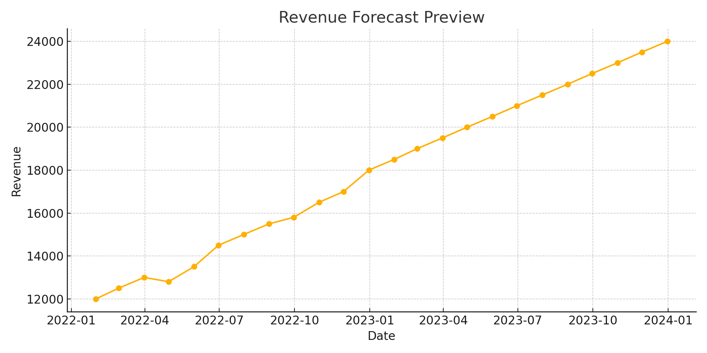

# 📊 Business Financial KPI Predictive Dashboard

This dashboard helps visualize, forecast, and analyze key financial performance indicators using machine learning.

## 🔧 Features

- 📈 Revenue forecasting with **Facebook Prophet**
- 📊 Interactive visualizations with **Streamlit**
- 📘 Model development in **Jupyter Notebook**
- 🧱 Clean project structure for production-ready deployment

## 🚀 Getting Started

### 1. Clone the Repository
```bash
git clone https://github.com/YOUR_USERNAME/business-financial-kpi-predictive-dashboard.git
cd business-financial-kpi-predictive-dashboard
```

### 2. Set Up the Environment
```bash
python -m venv venv
source venv/bin/activate  # On Windows: venv\Scripts\activate
pip install -r requirements.txt
```

### 3. Launch the Dashboard
```bash
streamlit run dashboard/app.py
```

## 📘 Model Development
Explore the notebook:
```
notebooks/revenue_forecasting.ipynb
```

It demonstrates:
- Loading data
- Fitting a Prophet model
- Plotting forecasts

## 🌐 Deploy on Streamlit Cloud
1. Push code to your GitHub repo
2. Go to https://streamlit.io/cloud
3. Click "New App"
4. Connect your GitHub and select:
   - Repo: `business-financial-kpi-predictive-dashboard`
   - File: `dashboard/app.py`

## 🖼 Dashboard Preview



## 📁 Project Structure

```
📦 business-financial-kpi-predictive-dashboard
├── 📊 dashboard/
│   ├── app.py
├── 📈 notebooks/
│   ├── revenue_forecasting.ipynb
├── 📁 data/
│   ├── sample_financial_data.csv
├── 🧠 utils/
│   ├── forecasting.py
├── 📦 models/
├── requirements.txt
└── README.md
```

## 📜 License
MIT
